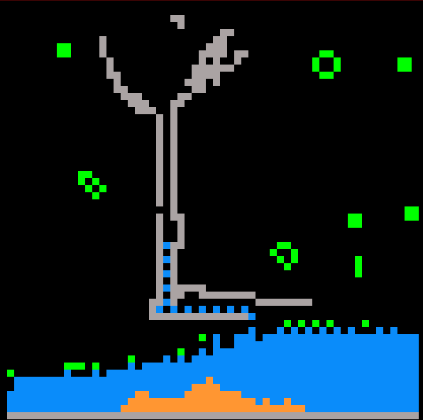

# fallingSand

a place to play with falling sand simulations in processing, p5 and python

I am using some ideas and logic from this great blog.

 https://blog.winter.dev/2020/falling-sand-games/
 
However I am implementing like 'game of life'  using two arrays grid[][] and nextGrid[][]

[fixed] having some trouble with the logic of sand falling through water 

use the drag and press the mouse while holding 

- 's' to drop sand

- 'w' to drop water

- 'r' to place rock (even in the sky )

- 'x' to destroy

I would like to add some living growing plants

Water was overwriting sand in the base case when there was no movement for it. needed to check that that cell had not turned to sand 

in the next generation

sand in water makes tall towers because it only checks the spot below

sand in air makes pyramids becaues it checks down left and right

## p5 version is a bit slow but you can play on line

[falling sand p5 live](https://greggelong.github.io/fallingSand/fallingSandP5)

## falling sand with life.  

had to solve some logic problems.  

needed to be more specific about life cases

life needs to check empty spaces as well as full ones so you must have a case not to overwrite by checking if another element has placed something in the nextGrid

also made the possibility of updateing life only every 2,3,4, frames using modulo

to modulate the update rate of life elements, it must be done in the life case function

and if it is not mod(2) or more you need to not do the rules

but fill the next state with either the grid value or the nextgrid value if it is not 0

otherwise you will be overwriting all of the other elements

[falling sand p5 with life live](https://greggelong.github.io/fallingSand/fallingSandP5Life)

since water and empty space create life // not just water alone

you can make a one pixel wide pipe with rock and transfer water through it without the water making life

After seeing more than a few videos about falling sand simulations, I made a version in processing and p5js. Using two 2d arrays one for current and one for update.  After finding the logic that would let sand fall through water, I gave implementing Conway's game of life at the same time.  Had fun solving more logic problems that had one case of life over writing the update array.  In the arrays 0 is empty, 1 is live cell, 2 is sand cell, 3 is water cell and 4 is rock cell.  A happy coincidence is that a cell of water with enough empty space creates life.  It makes Game of life much more interactive, as you can blast gliders with sand. I will try and make a space shooter with gliders and 'sand' based on this principle.  Code, and links to a live p5 version for the browser at https://github.com/greggelong/fallingSand

